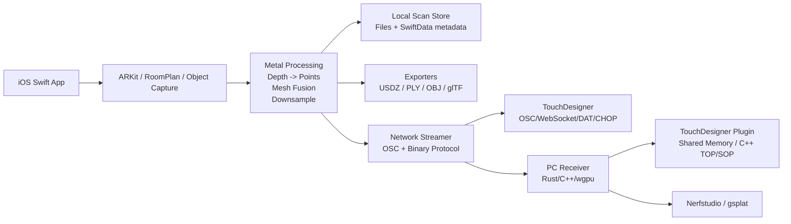

# OpenLidar Implementation Plan

OpenLidar is a free, local-first iOS scanning app inspired by Polycam's core workflows: LiDAR space scans, object capture, room/floorplan capture, exports, and live streaming to PC/TouchDesigner. It must not copy Polycam branding, UI, or closed algorithms.

## Product Scope

### Core Modes
- LiDAR Space Scan: ARKit mesh reconstruction, depth, point cloud preview, measurements, export.
- Room/Floorplan Scan: RoomPlan capture and 2D/3D export.
- Object Capture: guided photo capture with RealityKit Object Capture where supported.
- Live Streaming: camera pose, point cloud chunks, mesh updates, RGB/depth previews to TouchDesigner or a dedicated PC receiver.
- Gaussian Splat Dataset Export: collect RGB frames, poses, intrinsics, optional depth, and seed point clouds for PC-side training.

### Non-Goals For MVP
- Cloud reconstruction.
- Full Gaussian Splat training on older iPhones.
- A complete Polycam feature clone in the first release.
- Heavy TouchDesigner Python parsing for high-rate point clouds.

## Architecture



## Recommended Stack

- Swift 6, SwiftUI, strict concurrency.
- ARKit for tracking, LiDAR mesh, scene depth, and camera frame data.
- RealityKit for preview and Object Capture integration.
- RoomPlan for floorplan/room reconstruction.
- Metal and Metal Performance Shaders for depth filtering, point generation, and downsampling.
- Network.framework for UDP/TCP transport on Apple platforms.
- SwiftData for scan metadata only; raw scan data is stored as chunked files.
- Rust/C++ for the optional high-performance PC receiver and TouchDesigner plugin.

## Performance Rules

- Keep the hot path GPU-first: `CVPixelBuffer -> CVMetalTextureCache -> Metal compute`.
- Avoid per-frame CPU arrays of `Float` for full-resolution depth.
- Use voxel/downsampled live point clouds. Target 50k-150k live points on older LiDAR iPhones.
- Use triple-buffered Metal buffers and bounded queues.
- Stream pose at 30-60 Hz, point cloud chunks at 5-15 Hz, mesh updates by changed anchors only.
- Adapt to thermal state, battery state, network throughput, and dropped AR frames.

## Streaming Design

### TouchDesigner-Friendly Layer
- OSC for control/status: pose, scan state, device info, frame stats.
- WebSocket or TCP DAT for small debug/status payloads.
- Useful for quick `.tox` prototyping.

### High-Performance Binary Layer
- UDP for lossy live point chunks.
- TCP/WebSocket for session metadata and reliable mesh/keyframe transfer.
- Quantized point payloads: `Int16 x/y/z`, `RGBA8`, `UInt8 confidence`, plus per-packet scale/offset.
- Packet types: hello, pose, point cloud chunk, mesh upsert, mesh remove, depth tile, camera frame, roomplan update.

## File Layout

```text
OpenLidar/
  Docs/
  Sources/OpenLidarCore/
  Sources/ScanStreaming/
  Sources/ScanExport/
  Sources/OpenLidarCLI/
  Apps/OpenLidarIOS/
  Tools/PCReceiver/
  TouchDesigner/OpenLidar.tox
```

## Milestones

1. Core package and protocol
   - Scan metadata, camera pose, point types.
   - Binary stream packet encoder/decoder.
   - PLY exporter.
   - Unit tests.

2. ARKit MVP
   - ARSession manager.
   - LiDAR availability detection.
   - Live camera pose and depth sample path.
   - Downsampled point cloud preview.

3. Streaming MVP
   - UDP point chunks.
   - OSC pose/status bridge.
   - TouchDesigner `.tox` receiver.

4. Mesh scan
   - ARMeshAnchor storage.
   - Chunked mesh persistence.
   - USDZ/OBJ/PLY export.

5. RoomPlan mode
   - Room capture flow.
   - USDZ/SVG/PDF floorplan exports.

6. Object Capture mode
   - Guided image collection.
   - RealityKit Object Capture integration.
   - Dataset export fallback.

7. PC receiver
   - Rust receiver app.
   - Live renderer.
   - Shared memory / TouchDesigner plugin integration.

8. Gaussian Splat pipeline
   - Nerfstudio dataset export.
   - Optional gsplat training launcher on PC.

## Initial MVP Definition

The first useful release is:
- iOS LiDAR scan session.
- Live downsampled point cloud.
- PLY export.
- UDP binary point stream.
- OSC pose/status stream.
- TouchDesigner receiver example.
