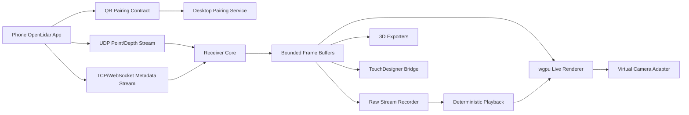

# OpenLidarStream Desktop - TDD and Clean Code Implementation Plan

Last updated: 2026-05-16

## 1. Product Goal

Build a multi-platform desktop receiver for OpenLidar live scanning.

The desktop app opens to a pairing screen with a QR code. The user scans the QR code from the phone app, starts a local network stream, watches the live scan on the computer, records the stream, exports 3D assets, and optionally exposes the live view as a virtual camera for other applications.

This plan assumes the phone-side capture app remains the source of ARKit LiDAR, RGB, pose, depth, mesh, and RoomPlan data. The desktop app is the receiving, visualization, recording, export, and bridge layer.

## 2. Existing Project Alignment

Use the existing OpenLidar direction instead of creating a separate incompatible protocol.

Relevant existing files:

- `Docs/IMPLEMENTATION_PLAN.md`
- `Docs/STREAMING_PROTOCOL.md`
- `Docs/ROADMAP_TODO.md`
- `Sources/ScanStreaming`
- `Sources/ScanExport`

The desktop app should treat `Docs/STREAMING_PROTOCOL.md` as the current protocol seed and evolve it through versioned fixtures and tests.

## 3. Primary External References

These are platform/API references to verify before implementation and during SDK upgrades:

- Apple ARKit scene reconstruction: https://developer.apple.com/documentation/arkit/arworldtrackingconfiguration/scenereconstruction
- Apple point cloud from scene depth sample: https://developer.apple.com/documentation/arkit/environmental_analysis/displaying_a_point_cloud_using_scene_depth
- Apple Core Media I/O camera extensions: https://developer.apple.com/documentation/coremediaio/creating-a-camera-extension-with-core-media-i-o
- Microsoft Media Foundation virtual camera API: https://learn.microsoft.com/en-us/windows/win32/api/mfvirtualcamera/nn-mfvirtualcamera-imfvirtualcamera
- Microsoft Frame Server custom media source: https://learn.microsoft.com/en-us/windows-hardware/drivers/stream/frame-server-custom-media-source
- Linux V4L2 userspace API: https://www.kernel.org/doc/html/latest/userspace-api/media/v4l/v4l2.html
- TouchDesigner C++ plugin guide: https://docs.derivative.ca/Write_a_CPlusPlus_Plugin

## 4. Functional Requirements

### 4.1 Pairing

- Desktop app starts a local receiver session.
- Desktop app shows a QR code containing the session endpoint, supported transports, session id, protocol version, and short-lived pairing token.
- Phone scans QR and connects without manual IP typing.
- Desktop shows connection state: waiting, authenticating, connected, degraded, disconnected.
- Pairing expires automatically and can be regenerated.
- The app supports multiple local IP candidates because Wi-Fi, Ethernet, VPN, and hotspot interfaces can coexist.

### 4.2 Streaming

- Receive phone data presets that match the phone and TouchDesigner node.
- Receive pose/status at high frequency.
- Receive point cloud chunks in a lossy low-latency stream.
- Receive metadata, mesh updates, and recording control over a reliable stream.
- Optionally receive RGB/depth image frames for preview and virtual camera output.
- Track packet loss, jitter, throughput, queue pressure, and receiver latency.

### 4.3 Visualization

- Render live point clouds with camera color when available.
- Render mesh updates when available.
- Display device pose, scan bounds, point count, FPS, dropped packets, and preset.
- Provide orbit/pan/zoom inspection.
- Provide reset view, top/front/side views, and fit-to-scan.
- Provide clipping, confidence filter, point size, color mode, and density controls.

### 4.4 Recording and Export

- Record raw stream packets for deterministic playback and debugging.
- Save session metadata, device info, calibration, intrinsics, preset, and protocol version.
- Export point clouds: PLY binary, PLY ASCII, XYZ, PTS, CSV.
- Export meshes: OBJ, PLY mesh, glTF/GLB, USDZ where feasible.
- Export datasets: RGB frames, depth frames, camera intrinsics, poses, seed point cloud, `transforms.json` for Gaussian Splat or NeRF pipelines.
- Validate exported files with small fixture tests.

### 4.5 Virtual Camera

- Provide a virtual camera output that can be selected in apps like OBS, Zoom, Discord, TouchDesigner, and video tools.
- First MVP virtual camera frame can be a 2D rendered preview of RGB/depth/point-cloud view.
- Later versions can expose multiple camera modes: RGB camera, depth visualization, point cloud render, mesh render, composited scan overlay.
- Platform backends:
  - macOS: Core Media I/O camera extension, not legacy DAL plugin.
  - Windows: Media Foundation virtual camera or Frame Server custom media source.
  - Linux: V4L2/v4l2loopback style output.
- Treat native virtual camera support as a separate adapter with its own tests and installers.

### 4.6 TouchDesigner Bridge

- The desktop app should not be required for TouchDesigner, but it can bridge data to TouchDesigner.
- Bridge outputs:
  - OSC pose/status for quick workflows.
  - Spout on Windows for image/texture output.
  - Syphon on macOS for image/texture output.
  - Shared memory for high-rate local data.
  - Recorded stream playback for TD debugging.

## 5. Non-Functional Requirements

- Local-first: no cloud dependency for MVP.
- Low latency target: live view below 100 ms on good LAN for point preview.
- Stable recording: never lose an already flushed recording because the renderer is overloaded.
- Backpressure aware: rendering, recording, and virtual camera outputs must use bounded queues.
- Cross-platform core: protocol, receiver, recording, playback, and export logic should be UI-independent.
- Deterministic tests: protocol fixtures must run without a phone.
- Security: QR token is short-lived; reject unknown session ids and incompatible protocol versions.
- Maintainability: platform-specific code is isolated behind adapter interfaces.

## 6. Recommended Architecture

Use a Rust-first desktop core because the app needs reliable networking, binary protocol parsing, high-throughput buffers, cross-platform packaging, and strong testability. Keep OS-specific virtual camera code behind narrow adapters.

UI options should be validated in Phase 0:

- Option A: Rust + `egui/eframe` + `wgpu` renderer.
- Option B: Rust core + Tauri UI + native renderer surface.
- Option C: C++/Qt app with shared C++ protocol core.

Recommendation for first implementation: Rust + `egui/eframe` + `wgpu`, unless a polished web UI becomes more important than renderer simplicity.



## 7. Proposed Folder Layout

Implementation can live under this folder or be moved into a repo-wide `Tools/` workspace later.

```text
OpenLidarStream_Desktop/
  IMPLEMENTATION_PLAN_TDD.md
  README.md
  docs/
    ADR/
    protocol-fixtures.md
    virtual-camera-backends.md
  crates/
    openlidar_protocol/
    openlidar_pairing/
    openlidar_receiver/
    openlidar_recording/
    openlidar_export/
    openlidar_renderer/
    openlidar_virtual_camera/
    openlidar_td_bridge/
    openlidar_desktop_app/
  fixtures/
    protocol/v1/
    recordings/
  tests/
    integration/
    e2e/
```

## 8. Clean Architecture Boundaries

### 8.1 Domain Layer

Pure types and rules. No sockets, files, UI, GPU, or OS APIs.

- `StreamSession`
- `PairingOffer`
- `DeviceCapabilities`
- `DataPreset`
- `PoseFrame`
- `PointCloudChunk`
- `MeshDelta`
- `DepthFrameDescriptor`
- `RecordingManifest`
- `ExportJob`
- `VirtualCameraMode`

### 8.2 Application Layer

Use cases that orchestrate domain objects.

- `CreatePairingSession`
- `AcceptPhoneConnection`
- `ReceiveStreamFrame`
- `RecordSession`
- `ReplayRecording`
- `ExportPointCloud`
- `ExportMesh`
- `PublishVirtualCameraFrame`
- `PublishTouchDesignerBridgeFrame`

### 8.3 Infrastructure Layer

Adapters for real-world APIs.

- UDP socket receiver
- TCP/WebSocket control channel
- QR code generator
- File system recorder
- `wgpu` renderer
- macOS Core Media I/O camera adapter
- Windows Media Foundation virtual camera adapter
- Linux V4L2 adapter
- Spout/Syphon/shared memory adapters

### 8.4 UI Layer

Thin state projection over application use cases.

- Pairing screen
- Live monitor
- Recording browser
- Export panel
- Virtual camera panel
- Diagnostics panel

## 9. Shared Data Presets

These preset ids must match phone, desktop, and TouchDesigner node. Treat them as a versioned manifest, not as UI-only labels.

| Preset ID | Purpose | Required Payloads | Optional Payloads | First Consumer |
| --- | --- | --- | --- | --- |
| `pose_only.v1` | Tracking and camera transform | pose, status | intrinsics | CHOP/debug |
| `rgb_preview.v1` | Camera-like preview | RGB frame, pose, intrinsics | depth thumbnail | virtual camera/TOP |
| `depth_camera.v1` | Kinect-like depth camera | depth frame, intrinsics, pose | RGB, confidence | TOP/virtual camera |
| `pointcloud_live.v1` | Live LiDAR points | point chunks, pose, intrinsics | RGB color, confidence | renderer/SOP |
| `mesh_live.v1` | Incremental scene mesh | mesh upsert/remove, pose | classification, vertex color | renderer/SOP/export |
| `roomplan_live.v1` | Room/floorplan capture | room objects, dimensions, pose | USD/USDZ export refs | DAT/SOP/export |
| `dataset_record.v1` | Offline reconstruction | RGB frames, poses, intrinsics | depth, seed points | export/GS pipeline |
| `diagnostic.v1` | Debugging protocol issues | all headers, stats, sample payloads | raw packet mirror | tests/DAT |

Rules:

- Phone may send only presets accepted in the QR pairing offer.
- Desktop must reject unknown required payloads with a clear error.
- Optional payload absence must degrade gracefully.
- Every preset change requires protocol fixture updates.
- TouchDesigner node uses the same ids and compatibility checks.

## 10. QR Pairing Contract

QR payload should be compact JSON for MVP and can move to CBOR later if needed.

Example:

```json
{
  "app": "OpenLidarStream",
  "role": "desktop_receiver",
  "protocol": "oldr-stream-v1",
  "sessionId": "01HYEXAMPLESESSION",
  "displayName": "Daniiar-MacBook",
  "expiresAt": "2026-05-16T12:10:00Z",
  "hostCandidates": ["192.168.1.42", "10.0.0.12"],
  "ports": {
    "udp": 39200,
    "control": 39201
  },
  "transports": ["udp_points", "websocket_control"],
  "acceptedPresets": ["pose_only.v1", "pointcloud_live.v1", "depth_camera.v1"],
  "pairingToken": "base64url-128-bit-token"
}
```

TDD expectations:

- Test serialization/deserialization.
- Test unknown fields are ignored.
- Test missing required fields fail.
- Test expired offers fail.
- Test incompatible protocol version fails.
- Test multiple host candidates are tried in order with fallback.

## 11. Protocol Evolution Plan

Use the existing binary envelope from `Docs/STREAMING_PROTOCOL.md`:

```text
uint32 magic
uint8 version
uint8 type
uint64 sequence
uint64 timestampNanoseconds
uint32 payloadSize
bytes payload
```

Phase changes:

- Keep JSON payloads only for debug and early tests.
- Define binary payload structs for pose, points, depth descriptors, mesh deltas, status, and session metadata.
- Add canonical little-endian or big-endian decision and freeze it in fixture tests.
- Add a fixture generator that writes known-good packets from the Swift side and validates them in the desktop receiver.
- Add compatibility matrix: phone protocol version vs desktop protocol version vs TD node version.

## 12. TDD Strategy

### 12.1 Test Pyramid

- Unit tests: domain types, QR payloads, packet headers, payload codecs, bounded queues, export math.
- Property tests: malformed packet sizes, sequence gaps, random point chunks, invalid QR payloads.
- Golden fixture tests: Swift-generated packets decoded by desktop and C++ TD node.
- Integration tests: fake phone streamer sends scripted sessions into receiver.
- Renderer tests: deterministic camera transforms, frame graph setup, non-empty render target smoke checks.
- Export tests: exported files load back and match fixture bounds/counts.
- Virtual camera tests: backend adapters accept frames and report status through fake OS interfaces first.
- E2E tests: fake phone -> receiver -> recording -> playback -> export.

### 12.2 Red-Green-Refactor Loop

For every feature:

1. Write a failing unit or integration test for the observable contract.
2. Implement the smallest production path that passes.
3. Refactor boundaries and names while tests stay green.
4. Add one regression test for the bug or edge case discovered.
5. Update docs and fixtures only after behavior is stable.

### 12.3 Required Test Fixtures

- Empty stream session.
- Pose-only stream for 5 seconds.
- Point cloud stream with packet loss.
- Point cloud stream with out-of-order packets.
- Depth camera stream with missing RGB.
- Mesh stream with add/update/remove anchors.
- Corrupt packet header.
- Version mismatch.
- Expired pairing QR.
- Recording playback determinism fixture.

## 13. Milestones and TODO Plan

### Phase 0 - Architecture Spike

- [ ] Create ADR for desktop technology choice.
- [ ] Create ADR for QR pairing contract.
- [ ] Create ADR for protocol endian/order/compatibility rules.
- [ ] Create ADR for virtual camera backend strategy.
- [ ] Build a fake phone packet generator from protocol fixtures.
- [ ] Decide Rust `egui/eframe` vs Tauri vs Qt after a one-day prototype.
- [ ] Define shared `DataPreset` manifest and fixture format.

TDD gate:

- [ ] QR payload tests exist before UI.
- [ ] Packet header tests exist before socket code.
- [ ] Fake stream tests exist before live phone testing.

### Phase 1 - Pairing MVP

- [ ] Implement local interface discovery.
- [ ] Implement session id and token generation.
- [ ] Implement QR JSON payload model.
- [ ] Generate QR image.
- [ ] Build initial pairing UI.
- [ ] Add pairing expiration and regenerate action.
- [ ] Add connection status state machine.
- [ ] Add tests for invalid, expired, and incompatible QR payloads.

Done when:

- [ ] Fake phone can read QR payload and connect to desktop control port.
- [ ] Desktop rejects wrong token.
- [ ] UI clearly shows waiting/connected/error states.

### Phase 2 - Receiver Core

- [ ] Implement UDP packet receiver.
- [ ] Implement reliable control channel.
- [ ] Implement packet sequence tracking.
- [ ] Implement packet loss and jitter metrics.
- [ ] Implement bounded frame queues.
- [ ] Decode pose/status packets.
- [ ] Decode quantized point cloud chunks.
- [ ] Add malformed packet tests.
- [ ] Add out-of-order and dropped packet integration tests.

Done when:

- [ ] Fake phone streams pose and point chunks into receiver.
- [ ] Receiver state can be inspected without UI.
- [ ] Backpressure drops preview frames without breaking recording.

### Phase 3 - Recording and Playback

- [ ] Define `RecordingManifest`.
- [ ] Record raw packets with monotonic receive timestamps.
- [ ] Store stream metadata and pairing offer.
- [ ] Add deterministic playback reader.
- [ ] Add corruption detection.
- [ ] Add recording browser model.
- [ ] Test playback produces same decoded frames as live receive fixture.

Done when:

- [ ] A fake session can be recorded, replayed, and decoded identically.

### Phase 4 - Renderer

- [ ] Create renderer abstraction independent from UI.
- [ ] Render point cloud fixture.
- [ ] Add camera orbit/pan/zoom controls.
- [ ] Add point size, confidence, depth range, color mode.
- [ ] Add mesh render path.
- [ ] Add frame timing metrics.
- [ ] Add smoke test that rendered output is not blank.

Done when:

- [ ] Recorded point cloud fixture can be played back and viewed.
- [ ] Renderer never blocks receiver thread.

### Phase 5 - Export

- [ ] Implement binary PLY point export.
- [ ] Implement ASCII PLY point export through shared exporter if not already reusable.
- [ ] Implement OBJ point/mesh export.
- [ ] Implement glTF/GLB export decision and prototype.
- [ ] Implement dataset export with RGB, depth, poses, intrinsics.
- [ ] Add export progress and cancellation.
- [ ] Add golden file tests for small fixtures.

Done when:

- [ ] Exported fixture files load back with expected point counts, bounds, and metadata.

### Phase 6 - Virtual Camera MVP

- [ ] Define `VirtualCameraFrame` model.
- [ ] Implement fake virtual camera adapter for tests.
- [ ] Implement renderer-to-camera frame conversion.
- [ ] Implement macOS Core Media I/O feasibility prototype.
- [ ] Implement Windows Media Foundation feasibility prototype.
- [ ] Implement Linux V4L2 feasibility prototype.
- [ ] Add UI panel for output mode and status.
- [ ] Add installation and permission diagnostics.

Done when:

- [ ] At least one platform can expose a test frame as a selectable camera.
- [ ] Other platforms fail gracefully with documented setup steps.

### Phase 7 - TouchDesigner Bridge

- [ ] Add OSC pose/status bridge.
- [ ] Add Spout output on Windows.
- [ ] Add Syphon output on macOS.
- [ ] Add shared memory output design.
- [ ] Add bridge status diagnostics.
- [ ] Add tests for bridge frame conversion with fake adapters.

Done when:

- [ ] TouchDesigner can receive pose/status and at least one image/texture stream from desktop.

### Phase 8 - Real Phone Integration

- [ ] Update phone app to scan QR and connect.
- [ ] Negotiate preset from phone to desktop.
- [ ] Stream pose/status.
- [ ] Stream quantized point chunks.
- [ ] Stream depth/RGB preview when selected.
- [ ] Test on real LiDAR iPhone/iPad.
- [ ] Record baseline latency, FPS, packet loss, and CPU/GPU usage.

Done when:

- [ ] Real device can pair, stream, record, replay, and export a small scan.

### Phase 9 - Packaging and Release

- [ ] Package macOS app.
- [ ] Package Windows installer.
- [ ] Package Linux AppImage/deb/rpm decision.
- [ ] Add code signing plan.
- [ ] Add virtual camera permission/setup docs.
- [ ] Add crash logs and diagnostic bundle export.
- [ ] Add release checklist.

Done when:

- [ ] A new user can install the app, pair a phone, record a scan, and export a file using documented steps.

## 14. ADR Drafts

### ADR-001: Use a Rust Core for Desktop Receiver

Status: Proposed

Context: The desktop app needs a reliable binary receiver, low-latency queues, playback, export, and cross-platform packaging.

Decision: Use Rust for protocol, pairing, receiver, recording, export, and renderer orchestration. Keep UI and OS integrations as adapters.

Alternatives:

- C++/Qt: mature native UI and plugins, but more memory safety risk and slower TDD loop.
- Electron: fast UI iteration, but heavier runtime and less natural high-throughput rendering path.
- Swift/macOS-only: too narrow for the requested multi-platform app.

Consequences:

- Positive: strong tests, clear package boundaries, good performance.
- Negative: native virtual camera APIs still require OS-specific code and installers.

### ADR-002: Use QR Pairing With Short-Lived Local Token

Status: Proposed

Context: Manual IP and port typing is fragile. Bonjour discovery is useful but not always available.

Decision: Desktop generates a QR offer with host candidates, ports, accepted presets, protocol version, session id, and expiring token.

Alternatives:

- Bonjour-only discovery: nice UX but can fail on restricted networks.
- Manual host entry: useful fallback but poor default.

Consequences:

- Positive: simple user flow and deterministic connection contract.
- Negative: QR payload must be protected from stale screenshots and version drift.

### ADR-003: Store Raw Stream Before Derived Exports

Status: Proposed

Context: Export formats and algorithms will evolve. Losing raw data prevents improved exports later.

Decision: Always record raw packets plus metadata; export PLY/OBJ/glTF/USDZ/dataset formats as derived artifacts.

Alternatives:

- Save only final point cloud or mesh: simpler but loses timing, metadata, and future reconstruction ability.

Consequences:

- Positive: deterministic replay, better debugging, future export improvements.
- Negative: higher storage usage.

### ADR-004: Virtual Camera Is a Platform Adapter, Not Core Logic

Status: Proposed

Context: Virtual camera APIs differ heavily across macOS, Windows, and Linux.

Decision: Core emits `VirtualCameraFrame`; each platform adapter handles registration, permissions, frame delivery, and installer concerns.

Alternatives:

- Use only OBS virtual camera: faster MVP but does not satisfy standalone product goal.
- Implement native camera first on every platform: high risk and slow.

Consequences:

- Positive: testable core and incremental platform rollout.
- Negative: feature parity will arrive gradually.

## 15. Clean Code Rules

- No socket code inside UI components.
- No file writes inside renderer.
- No packet parsing in virtual camera adapters.
- No unbounded queues between receiver, renderer, recorder, and exporters.
- All public protocol structs are versioned and fixture-tested.
- All units use explicit coordinate conventions and timestamps.
- Every platform adapter has a fake implementation for tests.
- Every bug fixed after repeated failure gets a regression test before the fix is considered complete.

## 16. Error Research Rule

Follow the project rule:

If the same error appears twice, stop retrying locally, research 3-5 plausible fixes from primary or highly reliable sources, choose the best fix, implement it, and record the decision in the relevant issue/ADR/test note.

## 17. Definition of Done for Desktop MVP

- Desktop opens to QR pairing.
- Phone pairs from QR without manual IP.
- Desktop receives pose and point cloud stream.
- Desktop shows live point cloud preview.
- Desktop records raw stream.
- Desktop replays recording deterministically.
- Desktop exports at least binary PLY.
- Desktop exposes at least one virtual camera backend or a documented adapter prototype.
- Protocol fixtures verify compatibility with the phone stream.
- TouchDesigner bridge can receive at least OSC pose/status.
- Core test suite passes in CI.

