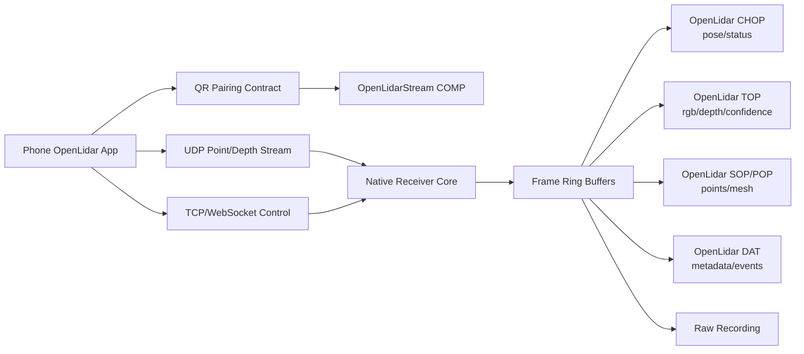

# OpenLidarStream TDNode - TDD and Clean Code Implementation Plan

Last updated: 2026-05-16

## 1. Product Goal

Build a TouchDesigner plugin node for OpenLidar live scanning.

The node shows or generates a QR pairing offer, the user scans it from the phone app, and TouchDesigner receives live LiDAR-style data for procedural processing. The behavior should feel similar to using a Kinect/Azure Kinect style input: channels for transforms/status, textures for RGB/depth/confidence, geometry for point clouds/meshes, and metadata/events for higher-level scan data.

The TouchDesigner node must use the same data presets as the phone and desktop receiver.

## 2. Existing Project Alignment

This plan depends on the shared OpenLidar stream contract:

- `Docs/STREAMING_PROTOCOL.md`
- `Docs/ROADMAP_TODO.md`
- `OpenLidarStream_Desktop/IMPLEMENTATION_PLAN_TDD.md`

Do not invent a separate TouchDesigner-only stream protocol. The node should decode the same packet fixtures as the desktop app.

## 3. Primary External References

These references should be checked during implementation and TouchDesigner version upgrades:

- TouchDesigner C++ plugin guide: https://docs.derivative.ca/Write_a_CPlusPlus_Plugin
- TouchDesigner CPlusPlus TOP: https://docs.derivative.ca/CPlusPlus_TOP
- TouchDesigner CPlusPlus CHOP: https://docs.derivative.ca/CPlusPlus_CHOP
- TouchDesigner CPlusPlus SOP: https://docs.derivative.ca/CPlusPlus_SOP
- TouchDesigner CPlusPlus DAT: https://docs.derivative.ca/CPlusPlus_DAT
- TouchDesigner Custom Operators: https://derivative.ca/UserGuide/Custom_Operators
- TouchDesigner Shared Memory: https://docs.derivative.ca/Shared_Memory

## 4. Functional Requirements

### 4.1 Pairing

- Node or wrapper COMP exposes a QR code for phone pairing.
- QR contains session id, host candidates, ports, protocol version, accepted presets, and expiring token.
- Node shows state: waiting, connected, receiving, degraded, disconnected, error.
- User can regenerate QR without restarting TouchDesigner.
- User can choose accepted preset before generating the QR.

### 4.2 Data Output

Provide Kinect-like outputs through TouchDesigner-native operator families:

- CHOP: pose, tracking status, frame counters, FPS, packet loss, bounds, device orientation.
- TOP: RGB preview, depth image, confidence image, depth visualization, rendered point preview if needed.
- SOP or POP: point cloud geometry, mesh geometry, normals, colors, classification attributes where available.
- DAT: metadata, session manifest, preset, device info, errors, room objects, event log.

The first implementation can be a `.tox` component wrapper around C++ OP plugins. A later implementation can become a full Custom OP with a polished create-menu experience.

### 4.3 Presets and Processing

- User selects a preset in TouchDesigner.
- Phone sends only the payloads required or accepted by that preset.
- Node exposes preset-specific parameters.
- Presets must match the phone and desktop app exactly by id.
- Processing presets should be deterministic and testable outside TouchDesigner where possible.

### 4.4 Recording and Playback

- Node can optionally record raw stream packets or delegate recording to the desktop receiver.
- Node can play fixture recordings for repeatable TouchDesigner network design.
- Playback mode should not require a phone.

### 4.5 Performance

- No Python parsing in the high-rate point cloud hot path.
- Decode packets in C++ or shared native core.
- Use bounded lock-free or low-lock queues between network thread and cook thread.
- Cook method must consume the latest coherent frame without blocking network receive.
- Large point buffers should be reused.
- Geometry output should support decimation and max point count.

## 5. Non-Functional Requirements

- Runs on supported TouchDesigner versions for Windows first; macOS support should be tracked separately.
- Native crash isolation is critical: invalid packets must not crash TouchDesigner.
- Version mismatch must produce a visible operator error.
- All protocol decoding is tested with fixtures before loading in TouchDesigner.
- All UI parameters have sane defaults for live performance.
- The node can degrade from mesh/depth to point/pose if phone capabilities are lower.

## 6. Recommended Architecture



## 7. Proposed Folder Layout

```text
OpenLidarStream_TDNode/
  IMPLEMENTATION_PLAN_TDD.md
  README.md
  docs/
    ADR/
    touchdesigner-setup.md
    parameter-reference.md
    troubleshooting.md
  cpp/
    OpenLidarStreamCore/
    OpenLidarCHOP/
    OpenLidarTOP/
    OpenLidarSOP/
    OpenLidarDAT/
    OpenLidarCustomOP/
  tox/
    OpenLidarStream.tox
    examples/
  fixtures/
    protocol/v1/
    recordings/
  tests/
    unit/
    integration/
    smoke/
  scripts/
    build_plugin.ps1
    build_plugin.sh
    package_tox.py
```

## 8. Clean Architecture Boundaries

### 8.1 Native Core

Pure C++ library with no TouchDesigner headers in core modules.

Responsibilities:

- QR pairing model.
- Packet header decoding.
- Payload decoding.
- Preset negotiation.
- Sequence tracking.
- Ring buffer ownership.
- Recording/playback.
- Processing filters that can be unit-tested.

### 8.2 TouchDesigner Adapter Layer

Thin C++ OP classes that translate core state into TouchDesigner outputs.

Responsibilities:

- Parameter definitions.
- Cook lifecycle.
- OP errors/warnings.
- CHOP/TOP/SOP/DAT output allocation.
- TouchDesigner-specific memory handoff.

### 8.3 Component Wrapper

`.tox` wrapper that provides user workflow.

Responsibilities:

- QR display.
- Preset controls.
- Start/stop/reconnect controls.
- Routing to CHOP/TOP/SOP/DAT outputs.
- Example networks.

## 9. Shared Data Presets

These preset ids must match phone, desktop, and TouchDesigner node. Treat them as a versioned manifest, not as UI-only labels.

| Preset ID | Purpose | Required Payloads | Optional Payloads | First Consumer |
| --- | --- | --- | --- | --- |
| `pose_only.v1` | Tracking and camera transform | pose, status | intrinsics | CHOP/debug |
| `rgb_preview.v1` | Camera-like preview | RGB frame, pose, intrinsics | depth thumbnail | virtual camera/TOP |
| `depth_camera.v1` | Kinect-like depth camera | depth frame, intrinsics, pose | RGB, confidence | TOP/virtual camera |
| `pointcloud_live.v1` | Live LiDAR points | point chunks, pose, intrinsics | RGB color, confidence | renderer/SOP |
| `mesh_live.v1` | Incremental scene mesh | mesh upsert/remove, pose | classification, vertex color | renderer/SOP/export |
| `roomplan_live.v1` | Room/floorplan capture | room objects, dimensions, pose | USD/USDZ export refs | DAT/SOP/export |
| `dataset_record.v1` | Offline reconstruction | RGB frames, poses, intrinsics | depth, seed points | export/GS pipeline |
| `diagnostic.v1` | Debugging protocol issues | all headers, stats, sample payloads | raw packet mirror | tests/DAT |

Rules:

- `pose_only.v1` must work on the weakest supported device.
- `pointcloud_live.v1` is the first useful LiDAR preset.
- `depth_camera.v1` should map most closely to Kinect-like workflows.
- `mesh_live.v1` can run at lower update rates than points/depth.
- `diagnostic.v1` is for debugging and should not be optimized for performance.

## 10. TouchDesigner Outputs

### 10.1 OpenLidar CHOP

Channels:

- `tx`, `ty`, `tz`
- `qx`, `qy`, `qz`, `qw`
- `fps_stream`, `fps_cook`
- `packet_loss`
- `latency_ms`
- `point_count`
- `mesh_vertex_count`
- `mesh_triangle_count`
- `bounds_min_x`, `bounds_min_y`, `bounds_min_z`
- `bounds_max_x`, `bounds_max_y`, `bounds_max_z`
- `tracking_state`
- `connection_state`

Tests:

- Decode pose fixture into expected channels.
- Missing pose yields stable previous value plus warning state.
- Channel order remains stable across versions.

### 10.2 OpenLidar TOP

Images:

- RGB frame.
- Depth normalized view.
- Confidence map.
- Optional composited preview.

Parameters:

- output mode
- depth min/max
- confidence threshold
- flip Y
- color map
- hold last frame

Tests:

- Decode depth fixture dimensions.
- Depth min/max mapping produces expected pixels.
- Missing optional confidence does not fail required RGB/depth output.

### 10.3 OpenLidar SOP or POP

Geometry:

- Points with position.
- Optional color.
- Optional confidence attribute.
- Optional normals.
- Mesh triangles for `mesh_live.v1`.

Parameters:

- max points
- decimation mode
- confidence threshold
- near/far clipping
- coordinate scale
- bake current frame pulse

Tests:

- Point fixture outputs expected count and bounds.
- Decimation is deterministic.
- Mesh add/update/remove fixture produces expected topology.

### 10.4 OpenLidar DAT

Tables/text:

- session metadata
- device capabilities
- selected preset
- errors/warnings
- event log
- room objects
- protocol stats

Tests:

- Session fixture produces stable metadata rows.
- Error fixture emits visible error text without throwing.

## 11. QR Pairing Contract

Use the same QR payload shape as the desktop receiver. For TouchDesigner, `role` should identify the receiver as `touchdesigner_node`.

Required fields:

- `app`
- `role`
- `protocol`
- `sessionId`
- `displayName`
- `expiresAt`
- `hostCandidates`
- `ports`
- `transports`
- `acceptedPresets`
- `pairingToken`

TDD expectations:

- Missing required field fails.
- Unknown field is ignored.
- Expired QR fails.
- Unsupported preset fails.
- Token mismatch fails.
- Multiple host candidates are preserved in order.

## 12. TDD Strategy

### 12.1 Tests Before TouchDesigner Loading

Most bugs must be caught before loading a DLL into TouchDesigner.

- Unit-test packet parsing.
- Unit-test preset negotiation.
- Unit-test ring buffers.
- Unit-test point/depth/mesh conversion.
- Unit-test QR payloads.
- Fuzz malformed packet headers and payload sizes.
- Run address sanitizer builds where available.

### 12.2 TouchDesigner Adapter Tests

Adapter tests are thinner and focus on lifecycle behavior.

- Plugin initializes and shuts down without leaks.
- Re-init releases network session cleanly.
- Cook with no data returns stable empty output.
- Cook with fixture data produces expected channel/image/geometry metadata.
- Invalid packet creates OP warning/error instead of crash.

### 12.3 Smoke Tests

Automated where possible, manual checklist where TouchDesigner automation is limited.

- Load `.tox`.
- Generate QR.
- Connect fake phone streamer.
- Verify CHOP channels update.
- Verify TOP frame updates.
- Verify SOP/POP point count updates.
- Disconnect and reconnect.
- Re-init plugin.
- Save and reopen `.toe`.

## 13. Milestones and TODO Plan

### Phase 0 - SDK and Architecture Spike

- [ ] Identify target TouchDesigner version and C++ compiler matrix.
- [ ] Build official CPlusPlus CHOP sample unchanged.
- [ ] Build official CPlusPlus TOP sample unchanged.
- [ ] Build official CPlusPlus SOP sample unchanged.
- [ ] Decide CPlusPlus OP pack vs Custom OP for MVP.
- [ ] Create ADR for plugin shape.
- [ ] Create ADR for protocol core sharing with desktop.
- [ ] Create fake phone streamer.

TDD gate:

- [ ] Native core test executable runs outside TouchDesigner.
- [ ] Protocol fixtures decode without TouchDesigner headers.

### Phase 1 - Native Protocol Core

- [ ] Implement packet header decoder.
- [ ] Implement QR pairing model.
- [ ] Implement preset negotiation.
- [ ] Implement UDP receiver.
- [ ] Implement control channel stub.
- [ ] Implement sequence/loss tracking.
- [ ] Implement frame ring buffers.
- [ ] Add malformed packet tests.
- [ ] Add fuzz tests for packet boundaries.

Done when:

- [ ] Fake phone can stream pose and point fixtures into native core.

### Phase 2 - CHOP MVP

- [ ] Implement OpenLidar CHOP plugin.
- [ ] Expose connection and preset parameters.
- [ ] Output pose/status/stat channels.
- [ ] Add stable channel order test.
- [ ] Add reconnect behavior.
- [ ] Add OP warnings for no connection/version mismatch.

Done when:

- [ ] TouchDesigner receives pose/status from fake phone.

### Phase 3 - TOP MVP

- [ ] Implement OpenLidar TOP plugin.
- [ ] Output RGB preview.
- [ ] Output depth visualization.
- [ ] Output confidence map if available.
- [ ] Add depth min/max and color map parameters.
- [ ] Add tests for pixel mapping from fixture depth.

Done when:

- [ ] TouchDesigner displays live depth/RGB frames from fake phone or fixture playback.

### Phase 4 - SOP/POP Point Cloud MVP

- [ ] Implement OpenLidar SOP or POP output decision.
- [ ] Output live point positions.
- [ ] Add color/confidence attributes.
- [ ] Add max point count.
- [ ] Add deterministic decimation.
- [ ] Add coordinate scale/axis conversion.
- [ ] Add tests for point count, bounds, attributes, and decimation.

Done when:

- [ ] TouchDesigner can render live OpenLidar point cloud as geometry.

### Phase 5 - Mesh and Room Data

- [ ] Decode mesh add/update/remove packets.
- [ ] Output mesh triangles.
- [ ] Preserve classification attributes where available.
- [ ] Output RoomPlan objects through DAT.
- [ ] Add room dimensions and object category rows.
- [ ] Add fixture tests for mesh lifecycle.

Done when:

- [ ] Mesh fixture updates produce expected TouchDesigner geometry and metadata.

### Phase 6 - `.tox` Wrapper and UX

- [ ] Build `OpenLidarStream.tox`.
- [ ] Add QR display panel.
- [ ] Add preset selector.
- [ ] Add status indicators.
- [ ] Route CHOP/TOP/SOP/DAT outputs.
- [ ] Add example networks:
  - point cloud render
  - depth threshold matte
  - pose-driven camera
  - mesh visualization
  - RoomPlan DAT layout
- [ ] Add parameter documentation.

Done when:

- [ ] A TouchDesigner user can drop the `.tox`, scan QR, and receive useful data without editing Python.

### Phase 7 - Recording and Playback

- [ ] Add raw recording writer.
- [ ] Add fixture playback mode.
- [ ] Add timeline scrubbing or frame stepping where practical.
- [ ] Add deterministic playback tests.
- [ ] Add export current frame to PLY/OBJ if useful.

Done when:

- [ ] Example networks can be developed from recordings without a phone.

### Phase 8 - Real Phone Integration

- [ ] Pair with actual phone app through QR.
- [ ] Test `pose_only.v1`.
- [ ] Test `pointcloud_live.v1`.
- [ ] Test `depth_camera.v1`.
- [ ] Test packet loss behavior.
- [ ] Test reconnect after phone sleep/app backgrounding.
- [ ] Measure cook time, receive latency, memory use, and point count.

Done when:

- [ ] Real LiDAR phone streams stable data into TouchDesigner for at least 10 minutes.

### Phase 9 - Packaging and Release

- [ ] Package plugin binaries for Windows.
- [ ] Package plugin binaries for macOS if supported.
- [ ] Package `.tox` examples.
- [ ] Add install guide.
- [ ] Add troubleshooting guide.
- [ ] Add version compatibility matrix.
- [ ] Add crash log collection instructions.

Done when:

- [ ] A user can install the node, open an example, scan QR, and process data.

## 14. ADR Drafts

### ADR-001: Use C++ Native Plugin Core for TouchDesigner Hot Path

Status: Proposed

Context: High-rate point cloud and depth data should not be parsed through Python DATs.

Decision: Implement packet decoding and frame buffers in C++. Keep Python only for wrapper UI glue if needed.

Alternatives:

- Python-only receiver: faster prototype but too slow and fragile for high-rate point clouds.
- Desktop-only bridge: simpler TD node, but user asked for direct QR connection inside TouchDesigner.

Consequences:

- Positive: better performance and lower cook-time pressure.
- Negative: more build and ABI complexity.

### ADR-002: Start With CPlusPlus OP Pack and `.tox` Wrapper

Status: Proposed

Context: TouchDesigner supports CPlusPlus CHOP/TOP/SOP/DAT plugins and full Custom Operators. A `.tox` wrapper gives better early UX while keeping plugin pieces testable.

Decision: Build CPlusPlus OPs first, compose them into an `OpenLidarStream.tox`, and evaluate a full Custom OP after MVP.

Alternatives:

- Full Custom OP first: polished integration but slower and higher risk.
- Only CPlusPlus DAT: too limited for depth/geometry workflows.

Consequences:

- Positive: incremental development and easier testing.
- Negative: more nodes visible internally until wrapped cleanly.

### ADR-003: Keep Protocol Core Independent From TouchDesigner Headers

Status: Proposed

Context: Protocol bugs should be testable in CI without launching TouchDesigner.

Decision: Build `OpenLidarStreamCore` as a normal C++ library. TouchDesigner OPs only adapt outputs.

Alternatives:

- Put all logic in OP classes: quick start but hard to test and easy to crash.

Consequences:

- Positive: faster tests, cleaner boundaries, lower crash risk.
- Negative: extra adapter code.

### ADR-004: Preset IDs Are Contract, Not UI Labels

Status: Proposed

Context: Phone, desktop, and TD node must agree on what data is sent.

Decision: Presets use stable ids like `pointcloud_live.v1`; UI labels can change without changing ids.

Alternatives:

- Free-form user labels: flexible but not reliable for negotiation.

Consequences:

- Positive: deterministic compatibility.
- Negative: every preset change needs version management.

## 15. Clean Code Rules

- No high-rate packet parsing in Python.
- No TouchDesigner API calls from receiver network threads.
- No unbounded queues.
- No protocol logic inside OP cook methods.
- No UI labels used as protocol identifiers.
- Every native core behavior has a unit test.
- Every fixture that desktop decodes must also decode in TD native core.
- OP classes must handle empty/missing data without crashes.
- Re-init must fully release sockets, threads, buffers, and file handles.

## 16. Error Research Rule

Follow the project rule:

If the same error appears twice, stop retrying locally, research 3-5 plausible fixes from primary or highly reliable sources, choose the best fix, implement it, and record the decision in the relevant issue/ADR/test note.

## 17. Definition of Done for TDNode MVP

- `.tox` or plugin node shows QR pairing.
- Phone pairs directly with TouchDesigner.
- Node receives `pose_only.v1`.
- Node receives `pointcloud_live.v1`.
- CHOP outputs pose/status/stats.
- TOP outputs at least one image stream or depth visualization when preset supports it.
- SOP/POP outputs point cloud geometry.
- DAT outputs session metadata and errors.
- Fake phone fixture can run without a physical device.
- Native core tests pass.
- Invalid packets do not crash TouchDesigner.
- Preset ids match phone and desktop docs.

